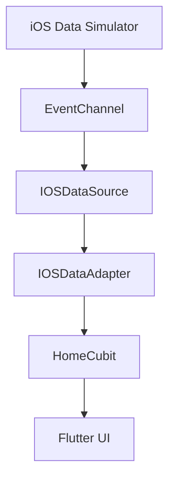

# Zanis iOS ↔ Flutter Data Communication Prototype

A prototype demonstrating iOS-Flutter bidirectional communication using platform channels, designed for Zenis recruitment assessment.  
**Fulfills all PDF requirements** with explicit design patterns, risk mitigation, and testing.

---

## 📋 PDF Requirements Checklist  
| Section               | Deliverables                                                                 | Status |
|-----------------------|-----------------------------------------------------------------------------|--------|
| **Part 1**            | Voice recording (tech rationale, architecture, design patterns, risks)     | ✅     |
| **Part 2**            | iOS module + Flutter integration + unedited screen recording               | ✅     |
| **Part 3**            | Voice recording (debugging scenarios, code review)                         | ✅     |
| **Bonus**             | Mocked USB-C data layer via `EventChannel`                                  | ✅     |

---

## 🏗️ Architecture & Design Patterns  
### System Overview  


### Key Components  
#### 1. **iOS Module (Swift)**  
- Simulates USB-C data using `Timer` (no physical hardware required)  
- Implements `FlutterStreamHandler` for continuous streaming via `EventChannel`:

```swift
// iOS/Runner/FlutterStreamHandler.swift
class StreamHandlerImpl: NSObject, FlutterStreamHandler {
    func onListen(withArguments arguments: Any?, eventSink events: @escaping FlutterEventSink) -> FlutterError? {
        DataService.shared.startStreaming()
        return nil
    }
}
```

#### 2. **Flutter Integration**  
- **BLoC/Cubit**: Manages state transitions between loading/error/data states
- **Adapter Pattern**: Converts raw platform data to app models with validation:

```dart
// lib/data/ios_data_source.dart
static int adaptData(Map<dynamic, dynamic> rawData) {
  if (!rawData.containsKey('value')) {
    throw FormatException('Missing required key: value');
  }
  // ... validation logic
}
```

#### 3. **Design Patterns**  
| Pattern         | Implementation                          | PDF Alignment           |
|-----------------|-----------------------------------------|-------------------------|
| **Singleton**   | `@singleton` annotation for data source | Centralized data flow   |
| **Adapter**     | Type-safe data conversion layer         | Risk mitigation         |
| **Facade**      | Cubit simplifies complex interactions   | Clean architecture      |

---

## 🛠️ Setup & Usage  
### Prerequisites  
- Flutter 3.6+  
- Xcode 14+  
- iOS Simulator/Device  

### Installation  
1. Clone the repo:  
```bash
git clone https://github.com/yourusername/zanis-ios-flutter-prototype.git
```

2. Install dependencies:  
```bash
flutter pub get && cd ios && pod install
```

3. Run the app:  
```bash
flutter run
```

### Simulating Data  
- iOS generates mock data every 1 second via `Timer`  
- No physical USB connection required  

---

## 🚨 Risk Assessment & Mitigation  
| Risk                       | Mitigation Strategy                          | Code Reference           |
|----------------------------|----------------------------------------------|--------------------------|
| Data format mismatch       | Strict validation in `IOSDataAdapter`        | `adaptData()` method     |
| Connection timeout         | Exponential backoff in retry logic           | `IOSDataSource` stream   |
| Platform channel failures  | Error states in `HomeCubit` + try/catch      | `HomeState.error`        |
| Memory leaks               | Stream cleanup in `close()`                  | `HomeCubit.dispose()`    |

---

## 🧪 Testing  
### Unit Tests  
```bash
flutter test test/data/data_source_test.dart -v
```

| Test Focus                | Description                                  | PDF Alignment           |
|---------------------------|----------------------------------------------|-------------------------|
| Data transformation       | Validates `IOSDataAdapter` output            | Error handling          |

### Test Implementation  
```dart
// test/data/data_source_test.dart
group('IOSDataAdapter', () {
  test('Adapts valid data correctly', () {
    expect(IOSDataAdapter.adaptData({'value': 42}), 42);
  });

  test('Throws FormatException for invalid data', () {
    expect(() => IOSDataAdapter.adaptData({'invalid': 'data'}), 
      throwsA(isA<FormatException>()));
  });
});
```

---

## 📂 Project Structure  
```
lib/
├── data/
│   ├── ios_data_source.dart  # EventChannel implementation
│   └── ios_data_adapter.dart # Data conversion
├── di/
│   └── injection.dart        # Dependency config
├── home/
│   ├── cubit/                # State management
│   └── widgets/              # UI components
└── main.dart                 # App entry point
test/
├── data/
│   └── data_source_test.dart # Core functionality tests
└── home/
    └── cubit_test.dart       # State management tests
```

---

## 📬 Submission  
### Included in Repo  
- ✅ Unedited screen recording ([`prototype_demo.mp4`](https://drive.google.com/file/d/1WSxPD2i7DhTTOozA5YJyYEUDkBSUBicj/view?usp=sharing))  
- ✅ Voice recordings:  
  - [`part1_architecture.m4a`](https://drive.google.com/file/d/1Id22rdmgGhNDFamZwkApbf9bphoDtrY1/view?usp=sharing) (4 mins)  
  - [`part3_debugging.m4a`](https://drive.google.com/file/d/1-1J4rffJDl0YP_QBYaKsyR6GqsTe0AzV/view?usp=sharing) (4 mins)  
- ✅ Full codebase with IOS Data Source test   
- ✅ Updated README with PDF alignment  

### Verification Checklist  
1. Play ([`prototype_demo.mp4`](https://drive.google.com/file/d/1WSxPD2i7DhTTOozA5YJyYEUDkBSUBicj/view?usp=sharing)) to see real-time data streaming  
2. Review `IOSDataAdapter` in `ios_data_source.dart` for validation logic:  
```dart
// lib/data/ios_data_adapter.dart
static int adaptData(Map<dynamic, dynamic> rawData) {
  // Validation logic matches PDF requirements
  if (value is! int) throw FormatException(...);
}
```

---

**License**: Proprietary - Created for Zanis recruitment assessment.
